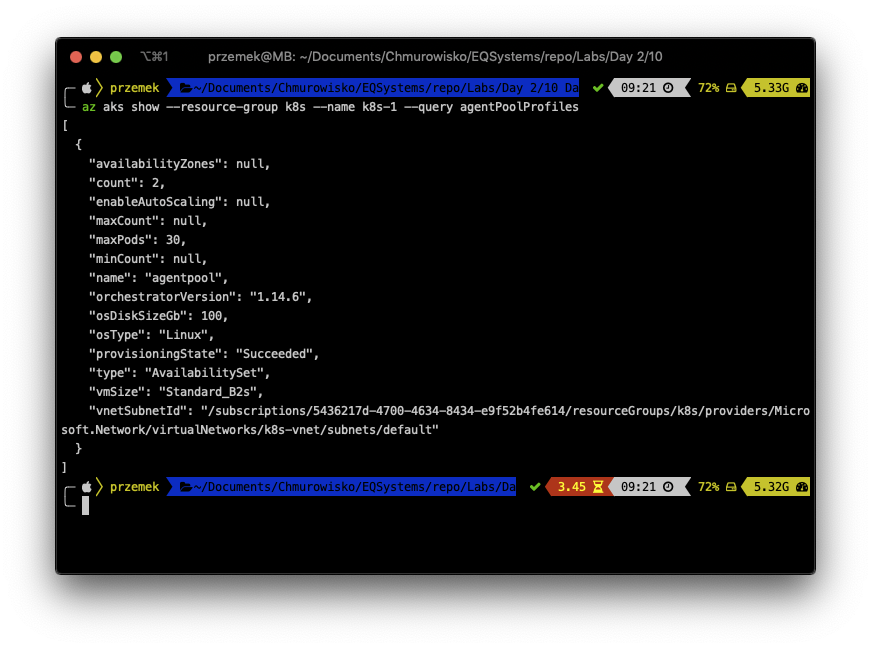
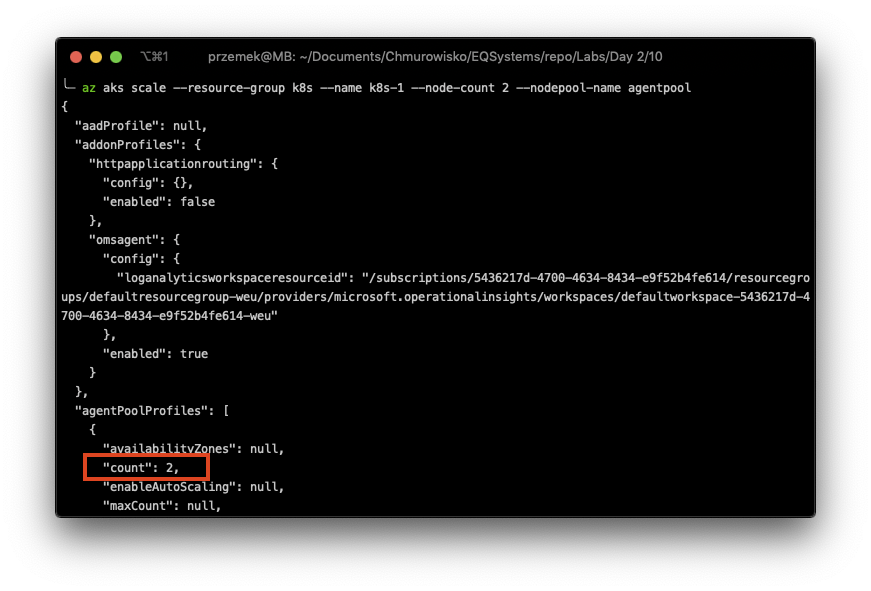
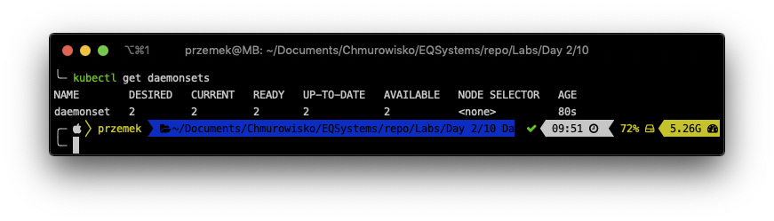
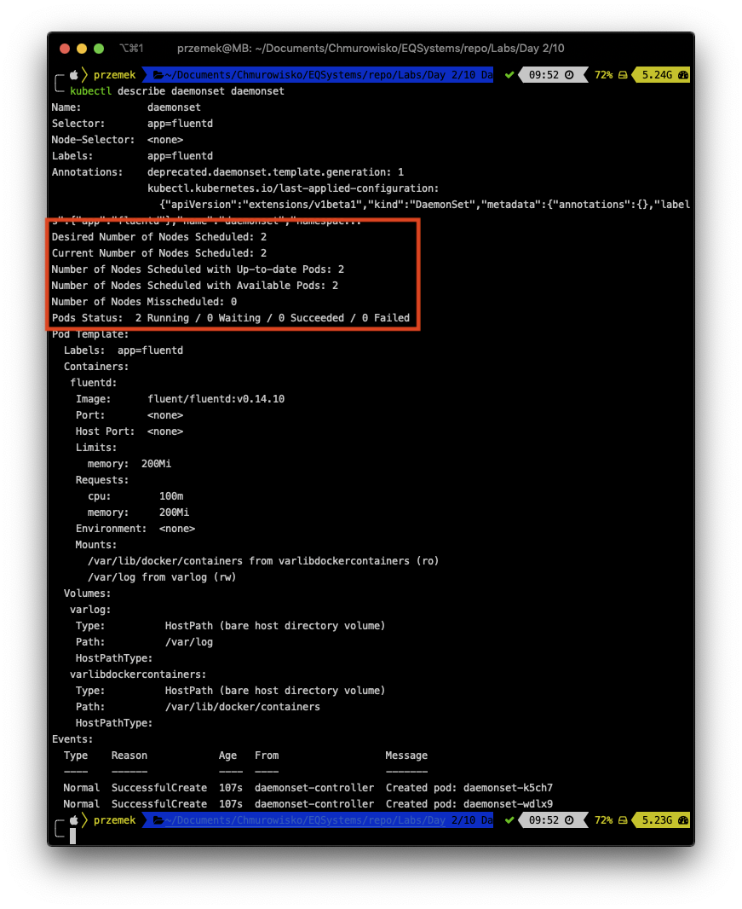
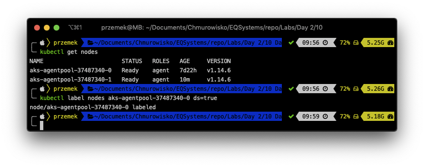
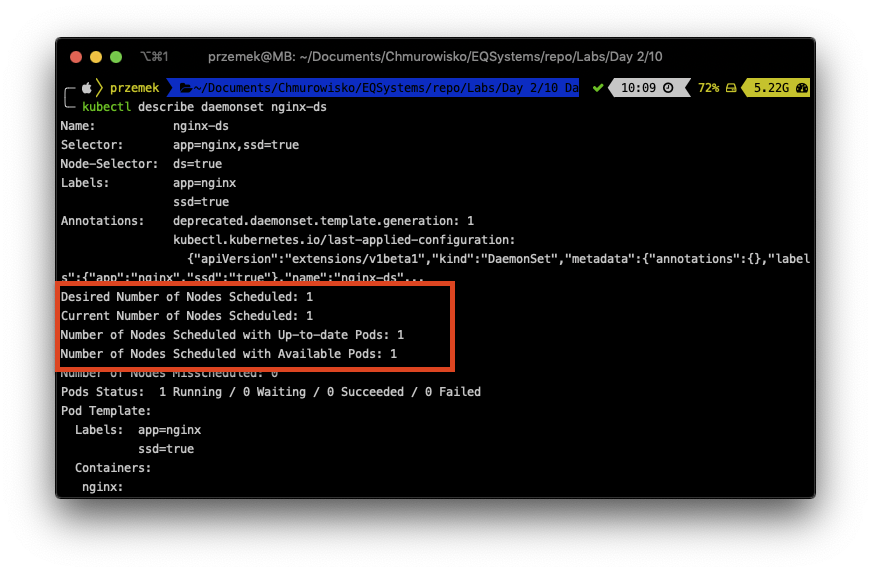
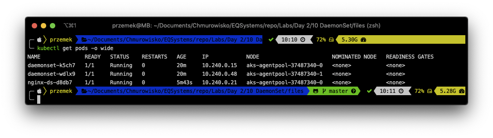

  
  
  

# DaemonSets

## LAB Overview

#### In this lab you will work with DaemonSets

A DaemonSet ensures a copy of a Pod is running across a set of nodes in a Kuber‐ netes cluster. DaemonSets are used to deploy system daemons such as log collectors and monitoring agents, which typically must run on every node.

## Task 1: Scale your Kubernetes cluster

For this lab you need more than one node in your cluster.
1. First, get the name of your node pool:

``
az aks show --resource-group myResourceGroup --name myAKSCluster --query agentPoolProfiles
``

Replace *myResourceGroup* and *myAKSCluster* with your values and execute command.

2. Using following command:

``az aks scale --resource-group myResourceGroup --name myAKSCluster --node-count 2 --nodepool-name <your node pool name>`` 

scale the cluster. Of course replace *myResourceGroup*, *myAKSCluster* and *<your node pool name>* with your values.

## Task 2: Creating a DeamonSet

1. Create new file by typing ``nano ds.yaml``.
2. Download [manifest file](./files/ds.yaml) and paste its content into editor.
3. Save changes by pressing *CTRL+O* and *CTRL-X*.
4. Type ``kubectl apply -f ds.yaml`` and press enter.
5. Get the list of running DaemonSets: ``kubectl get daemonsets``

and describe the DaemonSet: ``describe daemonset daemonset``
As you can see the Pods was successfully deployed to all two nodes in our cluster. 

## Task 3: Limiting DaemonSets to Specific Nodes

1. Get the list of your nodes:
``
kubectl get nodes
``
and add node labels to one of them:
``
kubectl label nodes <-YOUR-NODE-NAME-> ds=true
``
As always, replace <-YOUR-NODE-NAME-> with your value (the name of one of your nodes).

2. Create new file by typing ``nano ds_select.yaml``.
3. Download [manifest file](./files/ds_select.yaml) and paste its content into editor.
4. Save changes by pressing *CTRL+O* and *CTRL-X*.
5. Type ``kubectl apply -f ds_select.yaml`` and press enter.
6. Describe the daemonset: ``kubectl describe daemonset nginx-ds``

The Pod is now applied to only one of the nodes.
7. Get the list of Pods:
``
kubectl get pods -o wide
``

You should have two Pods running on one of your nodes and one on the second one.

8. Please delete both DaemonSets:

``
kubectl delete -f ds_select.yaml
kubectl delete -f ds.yaml
``

and rescale your cluster to one node:

``
az aks scale --resource-group myResourceGroup --name myAKSCluster --node-count 2 --nodepool-name <your node pool name>`` 

Of course replace *myResourceGroup*, *myAKSCluster* and *<your node pool name>* with your values.

## END LAB

  

&copy; 2019 Chmurowisko Sp. z o.o.

