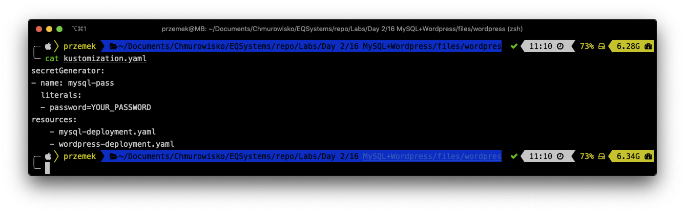
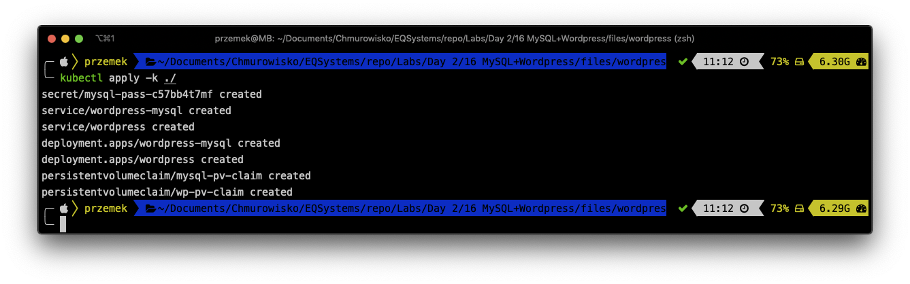
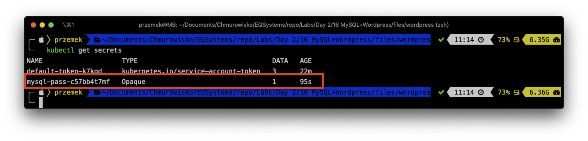
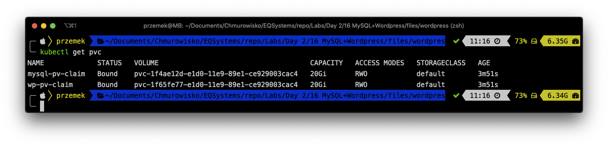
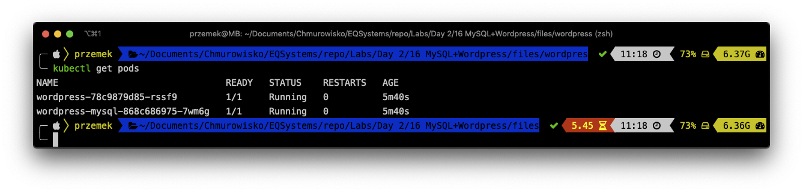
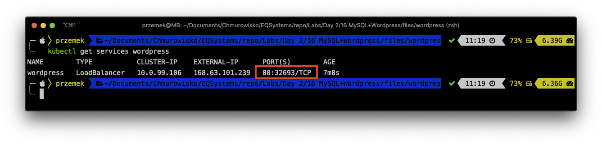
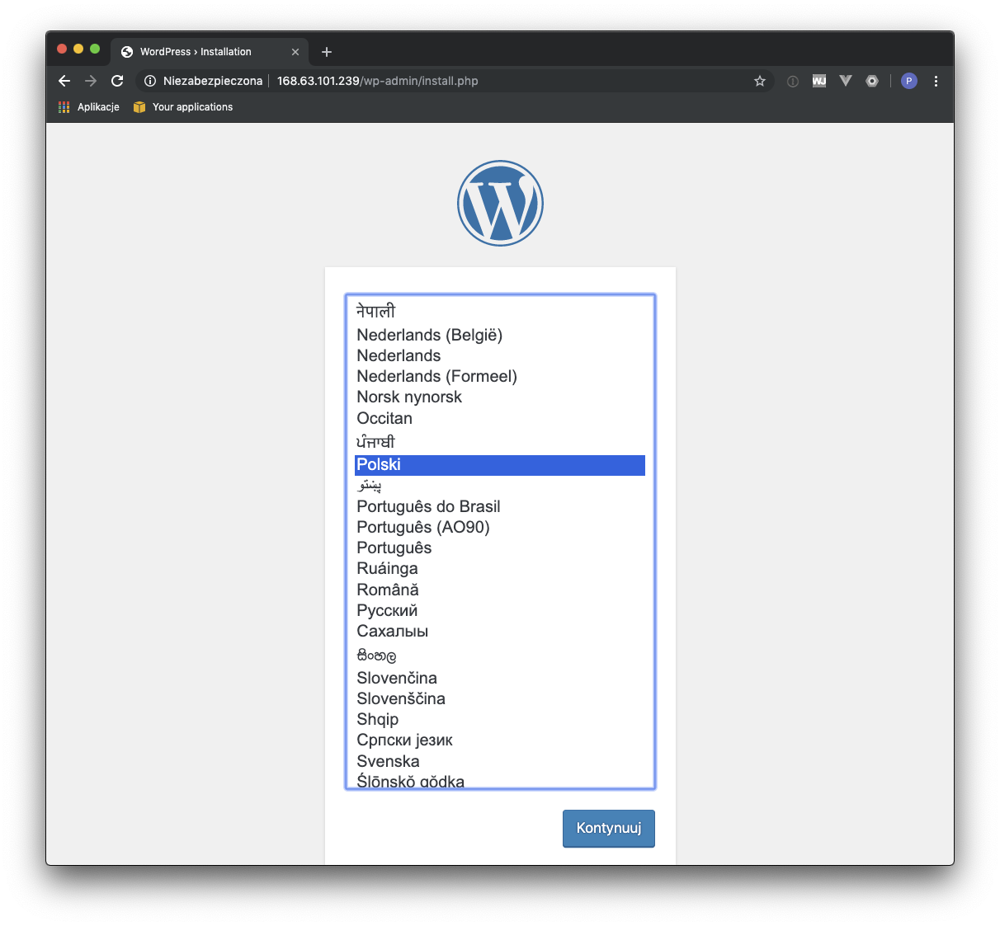

<br><br>
<br><br>
<br><br>

# MySQL + Wordpress

## LAB Overview

#### In this lab you will create Wordpress deployment


## Task1: Creating resource files

1. Create a new directory ``mkdir wordpress`` and enter it ``cd wordpress``.
2. Create a *kustimization.yaml* file by executing:
```
cat <<EOF >./kustomization.yaml
secretGenerator:
- name: mysql-pass
  literals:
  - password=YOUR_PASSWORD
EOF
```
**You need to replace YOUR_PASSWORD with the password you want to use!!!**

3. Create a new file by running ``nano mysql-deployment.yaml``.
2. Download [manifest file](./files/mysql-deployment.yaml) and paste its contents to editor window.
3. Save changes by pressing *CTRL+O* and *CTRL-X*.
4. Create a new file by running ``nano wordpress-deployment.yaml``.
5. Download [manifest file](./files/wordpress-deployment.yaml) and paste its contents to editor window.
6. Save changes by pressing *CTRL+O* and *CTRL-X*.
7. Add both deployment files to *kustimization.yaml* file:
```
cat <<EOF >>./kustomization.yaml
resources:
    - mysql-deployment.yaml
    - wordpress-deployment.yaml
EOF
```
8. Check *kustimization.yaml* file by running:
``
cat kustimization.yaml
``



## Task 2. Creating WordPress deployment

The kustomization.yaml contains all the resources for deploying a WordPress site and a MySQL database. 

1. Apply the directory by

``
kubectl apply -k ./
``


2. Verify that all object exists:
* Verify that the Secret exists by running the following command: ``kubectl get secrets``

* Verify that a PersistentVolume got dynamically provisioned: ``kubectl get pvc``

**Note:** It can take up to a few minutes for the PVs to be provisioned and bound.


* Verify that the Pod is running by running the following command: ``kubectl get pods``



* Verify that the Service is running by running the following command: ``kubectl get services wordpress``


3. Grab the EXTERNAL-IP address and try opening it in any browser. You should have your WordPress deployment ready.


**Warning:** This deployment is not suitable for production use cases, as it uses single instance WordPress and MySQL Pods.

4. Please delete all objects by running following commmand: ``kubectl delete -k ./``

## END LAB


<br><br>

<center><p>&copy; 2019 Chmurowisko Sp. z o.o.<p></center>
