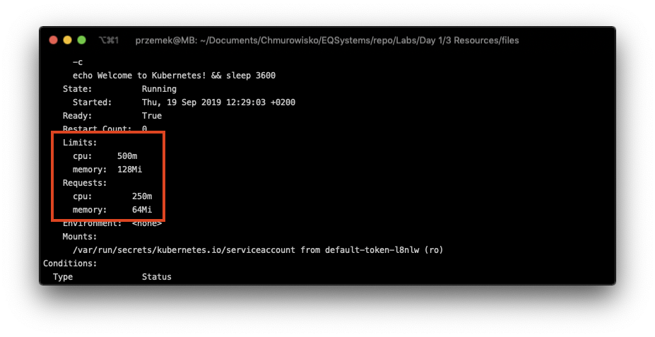

  
  
  

# Pod's resources management

## LAB Overview

#### In this lab you will create a Kubernetes pod with resource requirements and limits

## Task 1: Creating a pod 

1. Create new file by typing ``nano pod.yaml``.
2. Download [manifest file](./files/pod.yaml) and paste its content into editor.
3. Save changes by pressing *CTRL+O* and *CTRL-X*.
4. Type ``kubectl create -f pod.yaml`` and press enter.
5. Check if there is a pod created by typing ``kubectl get pods``.

## Task 2: Examinig pod settings

1. If the pod is ready and running execute following command:
``
kubectl describe pod my-resources-pod
``
2. Examine results and see if there are requirements and limits set for the pod.

3. Delete the pod using ``kubectl delete pod my-resources-pod --grace-period=1`` command.
## END LAB

  

&copy; 2019 Chmurowisko Sp. z o.o.

