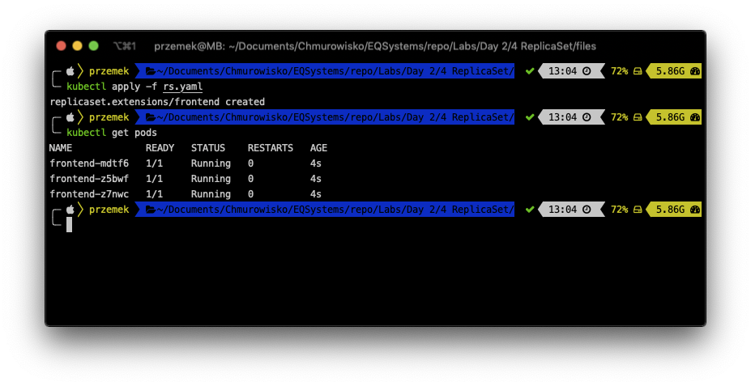
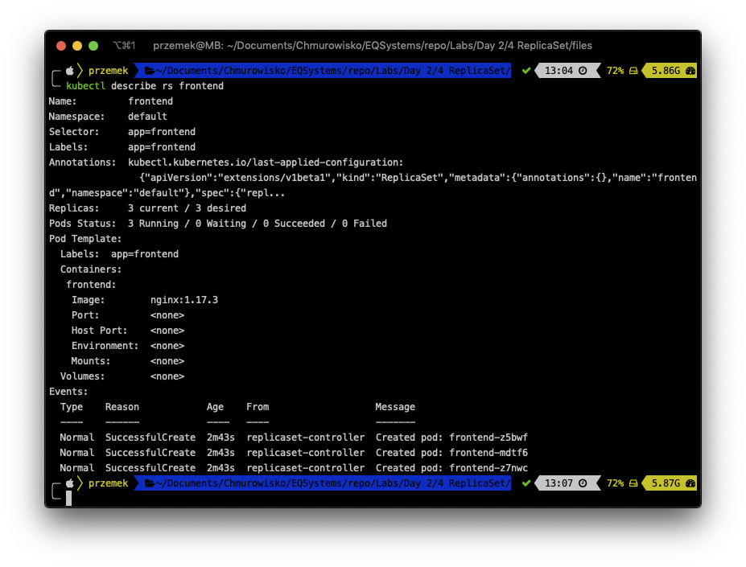
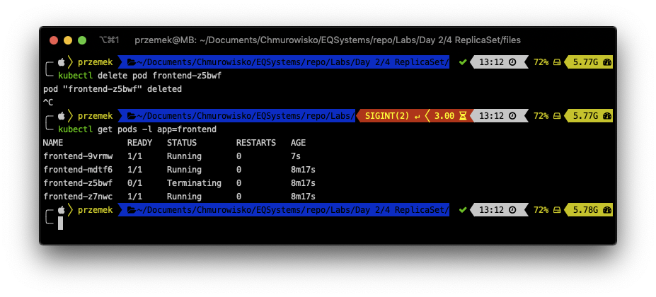

<br><br>
<br><br>
<br><br>

# ReplicaSet

## LAB Overview

#### In this lab you will work with a ReplicaSet

## Task 1: Creating a ReplicaSet 

1. Create new file by typing ``nano rs.yaml``.
2. Download [manifest file](./files/rs.yaml) and paste its content into editor.
3. Save changes by pressing *CTRL+O* and *CTRL-X*.
4. Type ``kubectl create -f rs.yaml`` and press enter.
5. Check if there is a pod created by typing ``kubectl get pods``.


## Task 2: Inspecting ReplicaSet and its behaviour

1. Execute following command:
``
kubectl describe rs frontend
``

You can see the label selector for the ReplicaSet, as well as the state of all of the repli‐ cas managed by the ReplicaSet.

2. Once again get a list of pods inside the replica ``kubectl get pods -l app=frontend``
3. Execute the following command ``kubectl delete pod <POD-NAME>`` but replace *<POD-NAME>* with one of the pod's name, i.e.: ``kubectl delete pod frontend-z5bwf``.
3. Get a list of pods ``kubectl get pods -l app=frontend``

As you can see, ReplicaSet still have 3 running pods.

## Task 3: Scaling ReplicaSet

You can scale ReplicaSet using declarative way by changing manifest file. But you can also do it imperative way.

1. Execute following command:
``
kubectl scale replicaset frontend --replicas=5
``
2. Get a list of pods ````kubectl get pods -l app=frontend``

Now you should have 5 pods running inside ReplicaSet.
3. Delete the replicaset by executing following command:
``
kubectl delete rs frontend
``
## END LAB

<br><br>

<center><p>&copy; 2019 Chmurowisko Sp. z o.o.<p></center>
