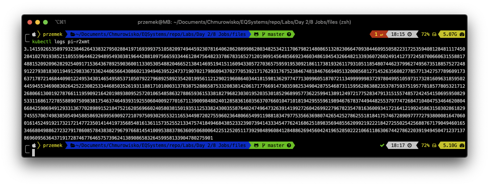

  
  
  

# Jobs

## LAB Overview

#### In this lab you will work with Jobs

A Job creates one or more Pods and ensures that a specified number of them successfully terminate

## Task 1: Creating a Job

In this task you will create a job that counts *pi* numbers.

1. Create new file by typing ``nano job_pi.yaml``.
2. Download [manifest file](./files/job_pi.yaml) and paste its content into editor.
3. Save changes by pressing *CTRL+O* and *CTRL-X*.
4. Type ``kubectl apply -f job_pi.yaml`` and press enter.
5. Check on the status of the Job running:
``
kubectl describe jobs pi
``
As you can see, the Job has one event and is still running

6. After a while Job finishes

## Task 2: Examinig results

1. To list all the Pods that belong to a Job run:
``
kubectl get pods --selector=job-name=pi
``
2. To get the result of Job you eed to display Pod's logs:
``
kubectl logs <-YOUR-POD-NAME>
``

3. Please delete the Job:
``
kubectl delete job pi
``

## Task 3: Creating CronJob

1. Create new file by typing ``nano job_cron.yaml``.
2. Download [manifest file](./files/job_cron.yaml) and paste its content into editor.
3. Save changes by pressing *CTRL+O* and *CTRL-X*.
4. Type ``kubectl apply -f job_cron.yaml`` and press enter.
5. Check the staatus of the job:
``
kubectl describe cronjobs hello
``

As you can see, the *Last Schedule Time* is unset.
6. Wait a minute and run following command:
``
kubectl get cronjob hello
``
Now you can see **LAST SCHEDULE**

7. You can also watch the status of the Jobs:
``
kubectl get jobs --watch
``

## Task 4: Examine the logs of your Job's Pod

1. List the jobs by running:
``
kubectl get jobs
``
2. Copy the name of the youngest Job and tet pods for the Job.
``
kubectl get pods --selector=job-name=<-YOUR-JOB-NAME->
``
3. Finally, copy the Pod name and read its logs:
``
kubectl logs <-YOUR-POD-NAME->
``

4. Please delete the CronJob:
``
kubectl delete cronjob hello
``

## END LAB

  

&copy; 2019 Chmurowisko Sp. z o.o.

