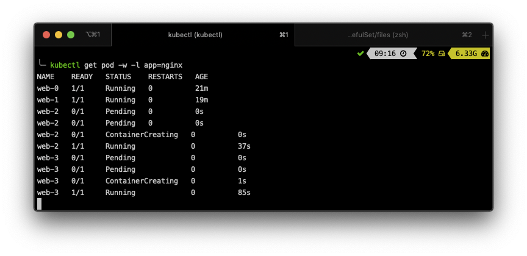

  
  
  

# StatefulSets

## LAB Overview

#### In this lab you will work with StatefulSets

StatefulSets are valuable for applications that require one or more of the following.
* Stable, unique network identifiers.
* Stable, persistent storage.
* Ordered, graceful deployment and scaling.
* Ordered, automated rolling updates.

## Task 1: Creating a StatefulSet

1. Open two terminal windows.
2. In the first one, run command ``kubectl get pods -w -l app=nginx`` to watch Pods creation.
3. In the second terminal window, create *statefulset.yaml* file by running ``nano statefulset.yaml``.
4. Download [StatefulSet manifest file](./files/statefulset.yaml) and paste its content into the editor.
5. Save changes by pressing *CTRL+O* and *CTRL-X*.
6. Still in the second terminal run the following commmand ``kubectl apply -f statefulset.yaml`` to create the StatefulSet.
7. Switch to the first terminal window and see how the Pods are created.

Notice that the web-1 Pod is not launched until the web-0 Pod is Running and Ready.

## Task 2: Examinig Pods Network Identifiwes

1. Each Pod has a stable hostname based on its ordinal index. Use kubectl exec to execute the hostname command in each Pod.

``
for i in 0 1; do kubectl exec web-$i -- sh -c 'hostname'; done
``

2. Use *kubectl run* to execute a container that provides the nslookup command from the dnsutils package:
``
kubectl run -i --tty --image busybox:1.28 dns-test --restart=Never --rm
``

3. Using nslookup on the Pods’ hostnames, you can examine their in-cluster DNS addresses Run
``nslookup web-0.nginx``
and 
``nslookup web-1.nginx`` inside a *busybox* container.

The CNAME of the headless service points to SRV records (one for each Pod that is Running and Ready). The SRV records point to A record entries that contain the Pods’ IP addresses.

4. Exit the container terminal by typing ``exit`` end pressing **Enter**.
5. In the first terminal window, run command ``kubectl get pods -w -l app=nginx`` to watch Pods deletion and recreation.
6. In the second terminal windows delete Pods from your StatefulSet:
``
kubectl delete pod -l app=nginx
``
7. Switch to the first terminal and watch the Pods recreation process.

8. Use *kubectl run* to execute a container that provides the nslookup command from the dnsutils package:
``
kubectl run -i --tty --image busybox:1.28 dns-test --restart=Never --rm
``

9. Using nslookup on the Pods’ hostnames, you can examine their in-cluster DNS addresses Run
``nslookup web-0.nginx``
and 
``nslookup web-1.nginx`` inside a *busybox* container.

The Pods’ ordinals, hostnames, SRV records, and A record names have not changed, but the IP addresses associated with the Pods may have changed. 

## Task 3: Writing to Stable Storage

1. Get the PersistentVolumeClaims for *web-0* and *web-1* Pods:``kubectl get pvc -l app=nginx``.

2. The NGINX webservers, by default, will serve an index file at */usr/share/nginx/html/index.html*. The volumeMounts field in the StatefulSets spec ensures that the */usr/share/nginx/html* directory is backed by a PersistentVolume.
Write the Pods’ hostnames to their index.html files:

``for i in 0 1; do kubectl exec web-$i -- sh -c 'echo $(hostname) > /usr/share/nginx/html/index.html'; done
``

3. Verify that the NGINX webservers serve the hostnames:

``
for i in 0 1; do kubectl exec -it web-$i -- curl localhost; done
``

4. In the first terminal, watch the StatefulSet’s Pods: ``kubectl get pod -w -l app=nginx`
2. In the second terminal, delete all of the StatefulSet’s Pods: ``kubectl delete pod -l app=nginx`
3. Examine the output of the kubectl get command in the first terminal, and wait for all of the Pods to transition to Running and Ready.

4. Verify the web servers continue to serve their hostnames: 
``
for i in 0 1; do kubectl exec -it web-$i -- curl localhost; done
``

## Task 4: Scaling the StatefulSet

1. In the first terminal, watch the StatefulSet’s Pods: ``kubectl get pod -w -l app=nginx`
2. In the second terminal window , use kubectl scale to scale the number of replicas to 4: ``kubectl scale sts web --replicas=4``
3. Examine the output of the kubectl get command in the first terminal, and wait for the two additional Pods to transition to Running and Ready.

The StatefulSet controller scaled the number of replicas. As with StatefulSet creation, the StatefulSet controller created each Pod sequentially with respect to its ordinal index, and it waited for each Pod’s predecessor to be Running and Ready before launching the subsequent Pod.
4. In the first terminal, still watch the StatefulSet’s Pods: ``kubectl get pod -w -l app=nginx`
5. In the second terminal window , use kubectl scale to scale the number of replicas to 2: ``kubectl scale sts web --replicas=2``

6. Please, delete both StatefulSet and Service.
``kubectl delete -f statefulset.yaml``

## END LAB

  

&copy; 2019 Chmurowisko Sp. z o.o.

